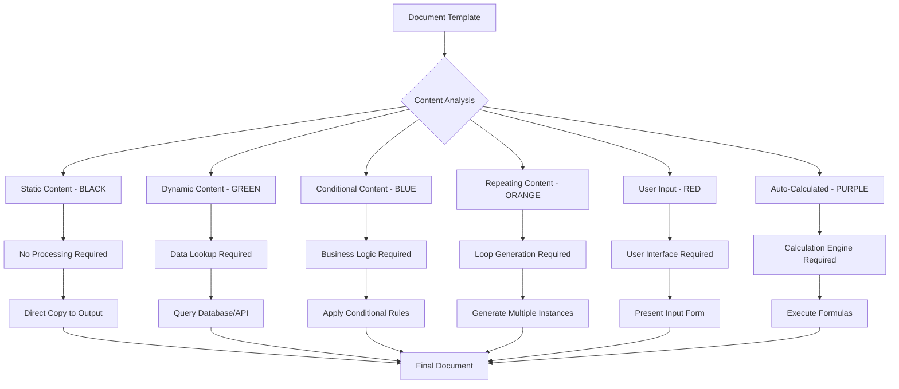
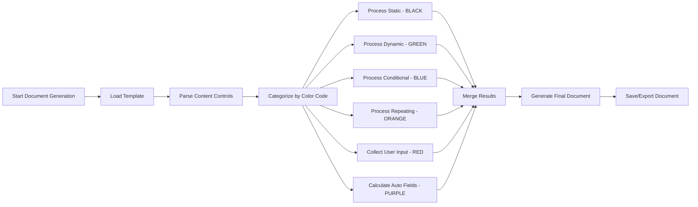
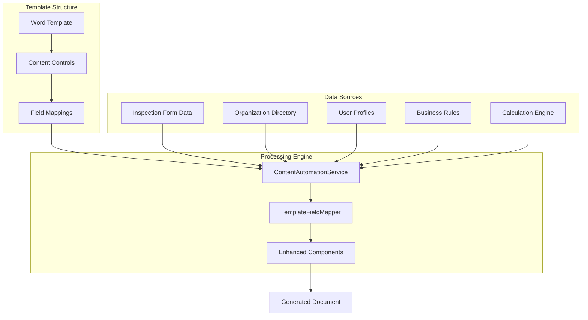

# Document Automation Flowchart

## Content Type Color-Coding System

## Automation Processing Workflow

## Content Control Mapping

## Color-Coding Legend

| Color | Type | Description | Processing Method |
|-------|------|-------------|-------------------|
| **BLACK** | Static | Fixed text, headers, labels | Direct copy |
| **GREEN** | Dynamic | Data from forms/database | Lookup & populate |
| **BLUE** | Conditional | Content based on rules | Apply business logic |
| **ORANGE** | Repeating | Lists, tables, iterations | Generate loops |
| **RED** | User Input | Manual entry required | User interface |
| **PURPLE** | Auto-Calculated | Computed values | Formula execution |

## Implementation Files

- `ContentAutomationService.ts` - Core automation logic
- `TemplateFieldMapper.tsx` - Visual field mapping
- `EnhancedApprovalLetter.tsx` - Example implementation
- Enhanced tab components with color-coding integration
- Updated Word templates with content control markup