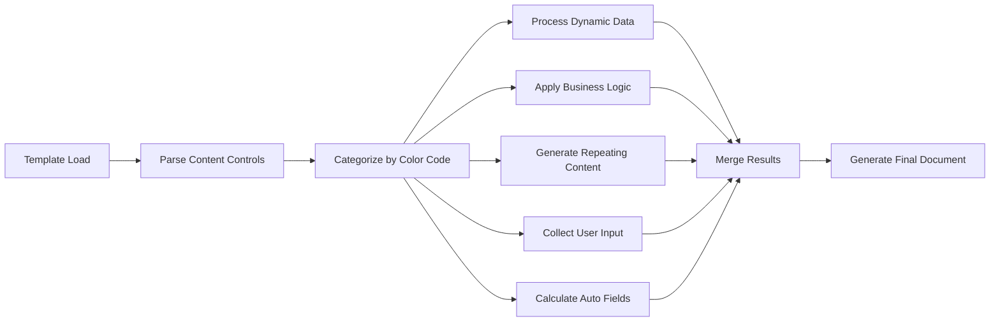

# Project INGOT - Inspection Management System
## Comprehensive Application Documentation & Requirements

### 🔍 Project Overview

**Project INGOT** is a comprehensive Inspection Management System designed for government security inspectors to streamline inspection processes, automate document generation, and ensure compliance with security protocols. The system supports multiple inspection types and integrates with Microsoft 365 environments.

### 🌟 Key Features & Capabilities

#### Core Inspection Workflows
- **1F & 1G Inspections**: Protected and Classified security inspections with intelligent checklists
- **19F & 19G Inspections**: Document and Memorandum-based workflows  
- **Final Report Generation**: Automated report creation from checklist responses
- **Document Management**: Template-based document automation with color-coding
- **Compliance Tracking**: Corrective measures and status monitoring

#### Advanced Checklist System *(Latest Feature)*
- **1F - Protected Checklist**: Preliminary questions, IT infrastructure, threat assessment, personnel security
- **1G - Classified Checklist**: Enhanced security controls, system location mapping, classified-specific requirements
- **Intelligent Analysis Engine**: Automated Final Report population from checklist responses
- **Smart File Integration**: Images auto-embed, documents become clickable links
- **Progress Tracking**: Real-time completion status with conditional logic
- **Confidence Scoring**: AI-powered analysis with reliability metrics

#### Document Automation Framework
**Color-Coding System for Template Automation:**
- **⚫ BLACK**: Static content (headers, labels) - Direct copy, no processing
- **🟢 GREEN**: Dynamic content - Data lookup from forms/database
- **🔵 BLUE**: Conditional content - Business logic application
- **🟠 ORANGE**: Repeating content - Loop generation for lists/tables  
- **🔴 RED**: User input required - Manual entry fields
- **🟣 PURPLE**: Auto-calculated - Formula execution and computed values

#### Multi-Language Support
- **UI Languages**: English/French interface switching
- **Document Languages**: Separate language control for generated documents
- **Translation System**: Comprehensive translation management
- **Context-Aware**: Language settings persist across sessions

---

## 🏗️ System Architecture & Technology Stack

### Frontend Technologies
- **React 18.3.1+**: Modern component-based UI framework
- **TypeScript 5.0+**: Type-safe development and enhanced IDE support
- **Vite 5.0+**: Fast build tool with hot module replacement
- **Tailwind CSS 3.0+**: Utility-first CSS framework with custom design system
- **Shadcn/ui**: Accessible component library built on Radix UI primitives

### Backend & Infrastructure
- **SharePoint Online**: M365-based backend platform
  - **Authentication**: Azure AD with MSAL for secure user management
  - **Database**: SharePoint Lists for structured data storage
  - **Storage**: SharePoint Document Library with version control
  - **Serverless Functions**: Power Automate flows for document generation and automation
  - **Integration**: Microsoft Graph API for M365 services

### File Management & Processing
- **React Dropzone**: Drag-and-drop file uploads
- **File Support**: Images (JPEG, PNG, GIF, WebP), Documents (PDF, DOC, DOCX, XLS, XLSX)
- **Upload Limits**: 25MB per file, multiple file support
- **Auto-Processing**: Image embedding and document linking in reports

### SharePoint Lists Schema
```
-- Core Lists
Inspectors: Inspector profile management with name, initials, email, folder path
Activities: Complete inspection data including org info, contract details, security level, dates
CorrectiveMeasures: Tracked corrective actions linked to activities
ApprovalCCs: CC recipients for approval letters
RunLog: Audit trail of all system actions and document generation

-- Document Library Structure
Templates/: Word template storage with content controls
Inspectors/[initials]/: Individual inspector folders for generated documents
```

---

## 🚀 Getting Started & Requirements

### System Requirements

#### Production Environment
- **CPU**: 2+ cores, 2.4GHz or higher
- **RAM**: 4GB minimum, 8GB recommended
- **Storage**: 10GB available space minimum
- **Network**: Stable internet connection (minimum 10 Mbps)

#### Browser Support (Latest Versions)
- ✅ **Google Chrome** 90+ (Recommended)
- ✅ **Mozilla Firefox** 88+
- ✅ **Microsoft Edge** 90+
- ✅ **Safari** 14+ (macOS only)

#### Development Prerequisites
```bash
Node.js: v18.0.0 or higher
npm: v9.0.0 or higher
Git: v2.28.0 or higher
Code Editor: VS Code, WebStorm, or similar
```

### Quick Setup & Installation

```bash
# Clone the repository
git clone <YOUR_GIT_URL>
cd <YOUR_PROJECT_NAME>

# Install dependencies
npm install

# Start development server
npm run dev

# Verify installations
node --version    # Should show v18.0.0+
npm --version     # Should show v9.0.0+
```

### Environment Configuration
```bash
# Azure AD Configuration
VITE_AZURE_TENANT_ID=[your-tenant-id]
VITE_AZURE_CLIENT_ID=[your-client-id]

# SharePoint Configuration
VITE_SHAREPOINT_SITE_URL=https://[tenant].sharepoint.com/sites/ProjectINGOT

# Power Automate Flow URLs
VITE_FLOW_CREATE_FOLDER=[flow-url]
VITE_FLOW_GENERATE_DOC=[flow-url]
VITE_FLOW_UPLOAD_DOC=[flow-url]

# Optional Production Variables
VITE_APP_VERSION=2.5.0
VITE_ENVIRONMENT=production
```

> **Important**: Copy `.env.example` to `.env.local` and fill in your values. See [SharePoint Deployment Guide](docs/SharePoint-Deployment-Guide-NonTechnical.md) for details.

---

## 👥 User Workflow & Application Features

### Multi-Tab Inspection Interface
1. **Inspector Info**: Profile setup (name, initials, email) and configuration
2. **Main Form**: Company details, contract information, organization lookup
3. **Search**: Activity management and historical inspection lookup
4. **Approval Letter**: Automated approval document generation
5. **Emails**: Communication templates and notification management
6. **DISIS Notes**: Integrated note-taking with date stamping
7. **Status**: Progress tracking and workflow monitoring
8. **Document/Memorandum**: 19F/19G specific workflows
9. **Inspection**: 1F/1G checklist workflows *(Enhanced in v2.5.0)*
10. **Corrective Measures**: Issue tracking and resolution management
11. **Supporting Documents**: File upload and organization
12. **Final Report**: Comprehensive report generation with automation

### Standard Inspection Process
1. **Setup Phase**: Inspector profile configuration and credentials
2. **Information Gathering**: Main form completion with auto-population
3. **Checklist Execution**: 
   - Select appropriate checklist type (1F Protected / 1G Classified)
   - Complete sections with conditional logic and file uploads
   - System tracks progress and validates completeness
4. **Intelligent Analysis**: Automated response processing and finding generation
5. **Report Generation**: Auto-populated Final Report with manual override capability
6. **Document Production**: Export professional documents and communications
7. **Workflow Completion**: Status tracking and activity archival

### Advanced File Integration
- **Smart Upload System**: Drag-and-drop with progress indicators and validation
- **Automatic Processing**: Images embed directly in Final Reports
- **Document Linking**: Files become interactive references with click-to-open
- **Format Support**: Comprehensive file type support with security scanning
- **Organization**: Files categorized by checklist section and question type

---

## 🔧 Development & Deployment

### Development Commands
```bash
# Development server with hot reload
npm run dev

# Type checking and validation
npm run type-check

# Production build generation
npm run build

# Preview production build locally
npm run preview

# Code quality and linting
npm run lint
```

### Deployment Options

#### Recommended Hosting Platforms
- **Vercel**: Automatic deployments with GitHub integration, serverless functions
- **Netlify**: Static site hosting with form handling and edge functions
- **AWS Amplify**: Full-stack deployment with CI/CD pipeline
- **Azure Static Web Apps**: Azure integration with custom domains
- **Lovable Platform**: One-click deployment via Share → Publish

#### Production Deployment Checklist
```bash
# Pre-deployment Verification
1. Run npm run build successfully
2. Verify environment variables are configured
3. Test database connectivity and permissions
4. Validate SSL/HTTPS configuration  
5. Check file upload and storage functionality
6. Verify authentication and user management
7. Test document generation and templates
8. Validate cross-browser compatibility
```

### Performance & Scalability Targets
- **Page Load Time**: < 3 seconds initial load
- **Navigation Speed**: < 1 second subsequent pages
- **File Upload**: Support for 25MB files with progress tracking
- **Concurrent Users**: 100+ simultaneous active sessions
- **Database Performance**: < 500ms average query response
- **Uptime Target**: 99.9% availability with monitoring

---

## 🔐 Security & Authentication

### Authentication System
- **Provider**: Azure AD with Microsoft Authentication Library (MSAL)
- **Session Management**: OAuth 2.0 tokens with automatic refresh
- **Profile System**: Integration with M365 user profiles
- **Role-Based Access**: SharePoint permissions and Azure AD groups

### Data Security Features
```
-- Security Implementation
SharePoint Permissions: List and folder-level access control
Encryption at Rest: Microsoft's enterprise-grade encryption
Encryption in Transit: TLS 1.3 for all communications
Input Validation: Client-side validation with Azure AD authentication
Secure API Access: Microsoft Graph API with OAuth 2.0
File Upload Security: SharePoint's built-in virus scanning and type validation
```

### Compliance & Standards
- **Web Standards**: HTML5, CSS3, ECMAScript 2022, WCAG 2.1 AA
- **Security Standards**: OWASP Top 10 protection, Microsoft security baseline
- **Government Standards**: Security clearance requirements, document classification handling
- **Privacy Compliance**: GDPR, CCPA ready with Microsoft 365 compliance features
- **Microsoft Compliance**: Adheres to M365 security and compliance standards

---

## 📋 Template System & Document Automation

### Word Template Integration
Located in `docs/word-templates/`:
```
ApprovalLetter.docx          # Standard approval letters
CSC_ApprovalLetter.docx      # CSC-specific approvals
Checklist_Protected.docx     # 1F checklist template  
Checklist_Classified.docx    # 1G checklist template
FinalReport.docx             # Comprehensive report template
Memorandum.docx              # Official memoranda
README-Templates.md          # Configuration guide
```

### Content Control Configuration
Templates use Microsoft Word content controls with naming conventions:
- `{field_name}` for simple text replacement
- `{section_repeat}` for repeating content blocks
- `{conditional_field}` for conditional content display
- Color-coded visual indicators for automation levels

### Automation Processing Workflow


---

## 🎯 Current Version: 2.5.0 - Advanced Checklist System

### ✨ Latest Release Features (September 2025)
- **🆕 Intelligent Checklist System**: Complete 1F/1G workflows with automated analysis
- **🤖 Smart Analysis Engine**: AI-powered Final Report generation from checklist responses
- **📎 Enhanced File Integration**: Automatic image embedding and document linking
- **📊 Real-time Progress Tracking**: Dynamic completion status with conditional logic
- **🔄 Workflow Automation**: Seamless integration between checklists and final reports
- **📱 Responsive Design**: Optimized for desktop and tablet usage

### 🛠️ Technical Improvements
- **React Dropzone Integration**: Enhanced file upload with drag-and-drop support
- **TypeScript Interfaces**: Comprehensive type safety for checklist data structures
- **Analysis Engine**: Confidence scoring and automated content generation
- **Performance Optimization**: Improved loading times and resource management
- **Error Handling**: Enhanced error tracking and user feedback systems

---

## 📊 Version History & Changelog

### Version 2.5.0 (Current) - Advanced Checklist System
**🚀 Major Feature Release**
- ✅ 1F (Protected) and 1G (Classified) checklist sub-tabs under Inspection
- ✅ Intelligent Analysis Engine with automated Final Report population  
- ✅ Advanced file upload system with drag-and-drop support
- ✅ Smart image embedding and document linking in reports
- ✅ Progress tracking with real-time completion status
- ✅ Conditional logic for dynamic question flows
- ✅ React Dropzone integration for file management
- ✅ Comprehensive analysis engine with confidence scoring

### Version 2.4.0 - Document Automation Framework  
**📄 Automation Enhancement**
- ✅ Content automation color-coding system implementation
- ✅ Template field mapping with visual indicators
- ✅ Enhanced approval letter generation capabilities
- ✅ ContentAutomationService with business logic engine
- ✅ Multi-language template support
- ✅ Word template integration with content controls

### Version 2.3.0 - Core Infrastructure & Multi-Tab Workflow
**🔧 Foundation Release**
- ✅ Complete Supabase integration (Auth, Database, Storage)
- ✅ Multi-tab inspection workflow implementation
- ✅ Inspector profile management system
- ✅ Main form with organization lookup functionality
- ✅ Search and activity management capabilities
- ✅ DISIS notes integration with date stamping
- ✅ Supporting documents management system
- ✅ Corrective measures tracking and resolution
- ✅ Multi-language support (EN/FR) with context switching
- ✅ Responsive design with Tailwind CSS and accessibility compliance

### Planned Features (Roadmap)
- 🔄 **PDF Form Integration**: Fillable PDF support for complex checklist sections
- 🔄 **Enhanced AI Analysis**: Advanced document parsing and intelligent content extraction
- 🔄 **Mobile Application**: React Native companion app for field inspections
- 🔄 **Advanced Reporting**: Business intelligence dashboard and analytics
- 🔄 **Workflow Automation**: Enhanced Power Automate and M365 integration
- 🔄 **Audit Trail System**: Comprehensive change tracking and version control
- 🔄 **Batch Processing**: Multi-inspection management and bulk operations
- 🔄 **Advanced Search**: Full-text search across all inspection data and documents

---

## 🔧 Integration & API Requirements

### Microsoft 365 Integration (Required)
```
Microsoft Graph API: v1.0 for M365 services
SharePoint Online: Required for data storage, document library, and collaboration
Power Automate: Required for document generation and automation workflows
Azure AD: Required for authentication and Single Sign-On (SSO)
MSAL (Microsoft Authentication Library): Client-side authentication
```

### SharePoint Lists API
- **List Operations**: Create, read, update, delete inspection data
- **File Operations**: Upload, download, and manage documents
- **Folder Management**: Automatic folder creation and organization
- **Permissions**: SharePoint-based access control

### Power Automate Flows
```typescript
// Required Flows
Create Inspector Folder: Automated folder structure creation
Generate Document: Word template population and document creation
Upload Supporting Documents: File upload and organization automation
```

### Microsoft Graph Endpoints
```typescript
// Core API Categories
Authentication: Azure AD OAuth 2.0 authentication
SharePoint Lists: CRUD operations via Microsoft Graph
Documents: SharePoint Document Library operations
Files: Upload, download, and file management
Users: Azure AD user profile access
```

---

## 🛠️ Troubleshooting & Support

### Common Issues & Solutions

#### Authentication Problems
```bash
# Issue: Login failures or session timeouts
# Solutions:
1. Verify Azure AD credentials in environment variables (VITE_AZURE_TENANT_ID, VITE_AZURE_CLIENT_ID)
2. Check Azure AD App Registration permissions and admin consent
3. Clear browser cache and cookies
4. Validate redirect URI matches deployment URL
5. Check internet connectivity and firewall settings
```

#### File Upload Issues
```bash  
# Issue: Upload failures or processing errors
# Solutions:
1. Check file size limits (25MB maximum per file)
2. Verify supported file formats (images, PDF, Office docs)
3. Ensure stable internet connection during uploads
4. Validate SharePoint folder permissions
5. Check Power Automate flow status (Upload Supporting Documents)
6. Verify VITE_FLOW_UPLOAD_DOC environment variable is configured
```

#### Template Generation Errors
```bash
# Issue: Document generation failures
# Solutions:
1. Validate Word template content controls and naming
2. Verify templates are uploaded to SharePoint Templates folder
3. Check Power Automate flow status (Generate Document)
4. Verify VITE_FLOW_GENERATE_DOC environment variable is configured
5. Check field mapping configuration and data completeness
6. Test with minimal data set to isolate issues
7. Review Power Automate run history for specific errors
```

#### Performance Issues
```bash
# Issue: Slow loading or poor responsiveness  
# Solutions:
1. Clear browser cache and restart application
2. Check network connectivity and latency
3. Optimize uploaded image file sizes
4. Monitor system resources and browser memory usage
```

### Debug Tools & Monitoring
- **Browser Developer Tools**: Console errors, network monitoring, performance analysis
- **Power Automate**: Flow run history, error details, and troubleshooting
- **SharePoint Admin Center**: List management, permissions, storage monitoring
- **Azure AD Portal**: Authentication logs, app registration status
- **Microsoft Graph Explorer**: API testing and debugging
- **Application Logging**: Built-in error tracking and performance metrics

### Support Resources
- **Built-in Documentation**: Contextual help available throughout application
- **Deployment Guides**: [Non-technical](docs/SharePoint-Deployment-Guide-NonTechnical.md) and [Technical](docs/SharePoint-Technical-Migration-Guide.md) guides
- **Template Configuration**: [Word template setup guide](docs/word-templates/README-Templates.md)
- **System Requirements**: [Detailed specifications](docs/SYSTEM-REQUIREMENTS.md)
- **M365 Integration**: [Complete implementation guide](docs/M365-Implementation-Guide.md)
- **GitHub Workflow**: [Version control and CI/CD guide](docs/GitHub-Deployment-Workflow.md)

---

## ⚙️ Maintenance & Operations

### Regular Maintenance Tasks
```bash
# Weekly Maintenance
- Security updates for all dependencies
- Database performance monitoring and optimization
- Backup verification and recovery testing
- Error log review and issue resolution

# Monthly Maintenance
- Full system health check and performance review
- Capacity planning assessment and resource monitoring
- Security audit and access control review
- User feedback analysis and feature planning

# Quarterly Maintenance
- Major dependency updates with comprehensive testing
- Infrastructure review and optimization
- Business continuity and disaster recovery testing
- Comprehensive user access and permissions audit
```

### Monitoring & Analytics
- **Application Performance**: Real-time monitoring with alerting
- **User Analytics**: Usage patterns and feature adoption tracking
- **Error Tracking**: Comprehensive error logging and analysis
- **Security Monitoring**: Access patterns and threat detection

---

## 📞 Project Information & Support

### Project Links & Resources
- **Lovable Project**: [Edit in Lovable](https://lovable.dev/projects/5de0c8ea-9941-4472-a148-fe7ccc971f11)
- **Live Demo**: Available through Lovable Share → Publish
- **Documentation**: Complete guides available in application
- **Templates**: Word templates with configuration instructions
- **Support**: Built-in contextual help and troubleshooting guides

### Custom Domain Setup
Navigate to Project > Settings > Domains and click Connect Domain.
Read more: [Setting up a custom domain](https://docs.lovable.dev/tips-tricks/custom-domain#step-by-step-guide)

### Development & Contribution
Changes made via Lovable automatically commit to the repository.
Local development changes push to both GitHub and Lovable.
Bidirectional sync ensures consistency across all development environments.

---

**Last Updated**: September 27, 2025  
**Current Version**: 2.5.0  
**Status**: Production Ready  
**Next Release**: Q4 2025 (PDF Integration & Enhanced AI Features)

*This documentation represents the complete feature set and capabilities of Project INGOT as of the current release. All requirements, setup procedures, and troubleshooting information are included for successful deployment and operation.*
